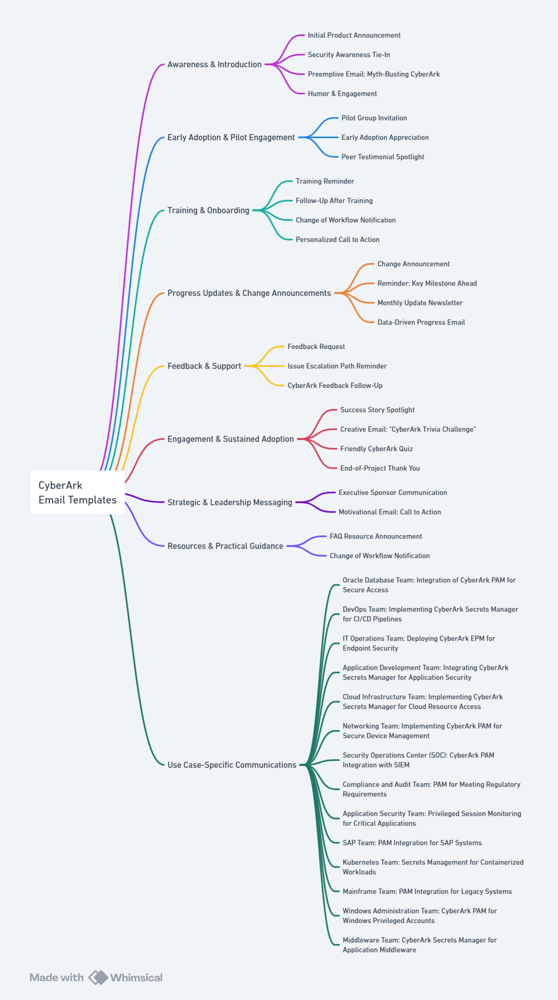

# CyberArk Email Templates Repository

Welcome to the CyberArk Email Templates repository! This resource is designed to help CyberArk administrators communicate effectively with stakeholders throughout the lifecycle of CyberArk projects, including PAM, EPM, and Secrets Manager implementations.

## Repository Structure
- **Email Templates/**: Contains categorized email templates for various stages and use cases.

## How to Use These Templates
1. Search for or locate the relevant email template.
2. Copy the email template into your email client.
3. Customize placeholders (e.g., `[Your Name]`, `[Insert Link]`) to fit your specific use case.
4. Send to the appropriate audience.

## Categories
- **Awareness and Introduction**: Launch new initiatives and create initial awareness.
- **Early Adoption & Pilot Engagement**: Involve early adopters and champions to refine the implementation.
- **Training & Onboarding**: Guide users through learning and adoption.
- **Progress Updates & Change Announcements**: Keep users informed and motivated during the rollout.
- **Feedback & Support**: Gather user insights and provide ongoing assistance.
- **Engagement & Sustained Adoption**: Drive enthusiasm, ongoing learning, and post-launch adoption.
- **Strategic & Leadership Messaging**: Templates from leadership to emphasize the importance of CyberArk and align priorities.
- **Resources & Practical Guidance**: Focused on practical tools and resources to empower users.
- **Use-Case Specific Templates**: Tailored emails for engaging specific technical teams (e.g., Oracle, DevOps, Kubernetes).

## Finding the Right Template

**Use the mind map below to determine which email template to use for your communication plan**

## Contact

Maintained by Eli Hopkins, [@IAM-Jah](https://github.com/IAM-Jah). Contact information is located in my profile.

## Acknowledgements

## License

## Disclaimer

This repository is for informational purposes and does not constitute legal advice. Ensure to consult with compliance and legal professionals for specific guidance. This is an unofficial repository and is not affiliated with CyberArk Software, Ltd.

---